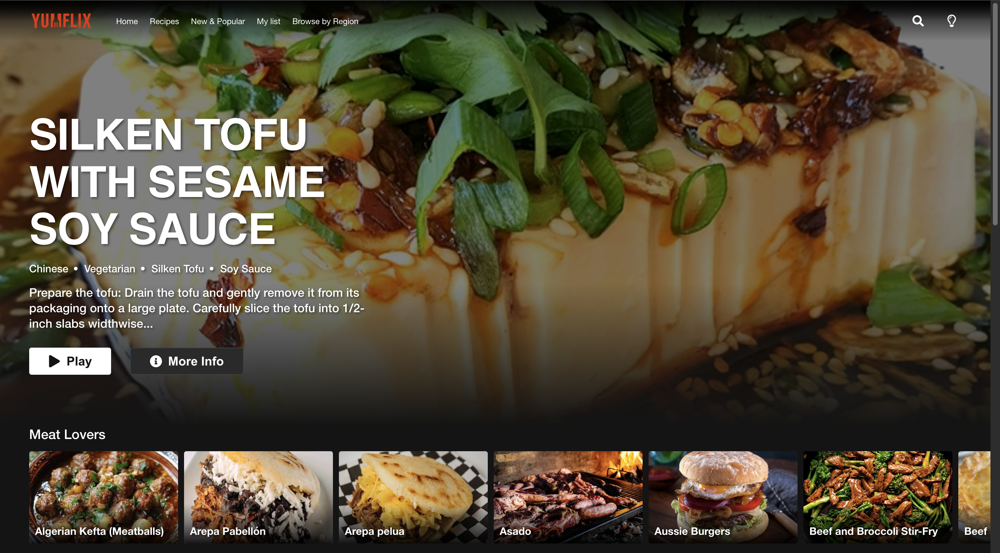
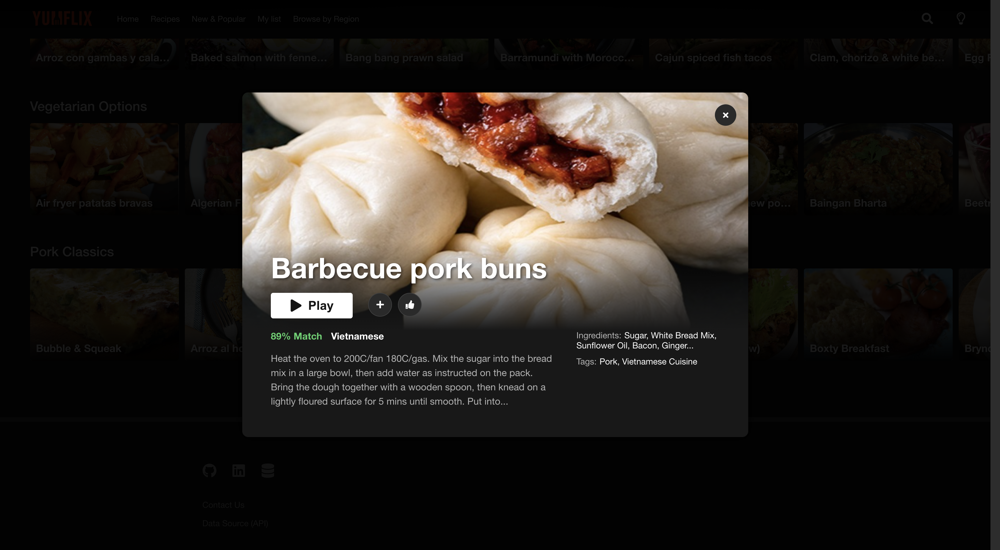
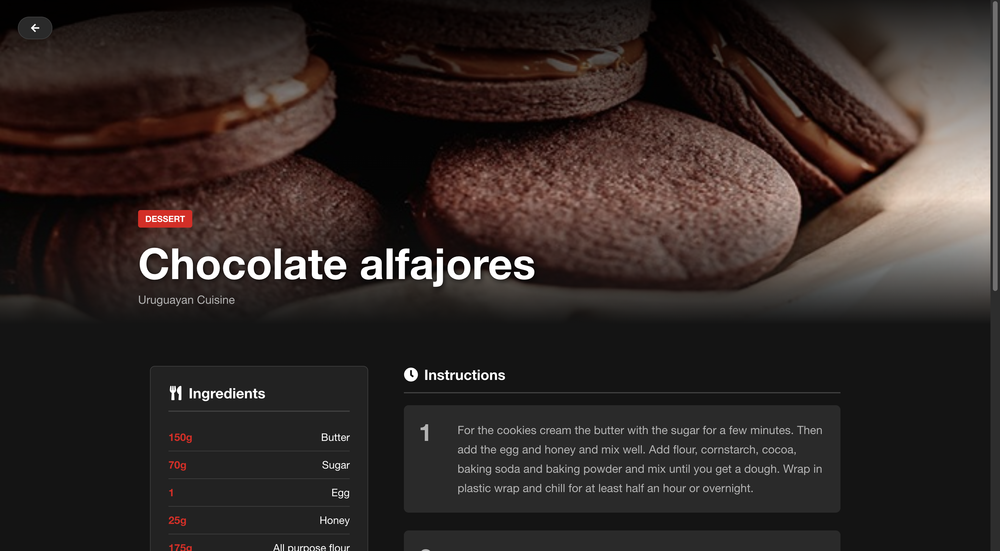
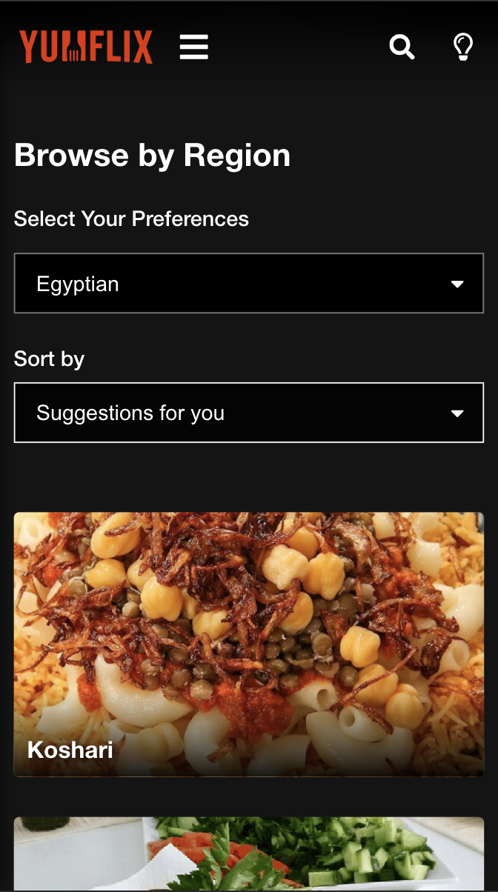

# 🍿 Yumflix - Unlimited Recipes, Cinematic Cooking

[](https://github.com/yriaforjan/yumflix)

## 🌟 Project Description

Yumflix is a web application that provides a cinematic browsing experience for recipes, modeled after streaming platforms like Netflix. It integrates with TheMealDB API to fetch and display recipes from around the world, allowing users to discover, search, and save recipes through an intuitive, visually-appealing interface.

## 🚀 Live Demo

You can explore the live application here:  
**👉🏼 [Yumflix Live Demo](https://yumflix.vercel.app/)**

## 📸 Preview

### 🎬 Featured Experience
> Immersive "Netflix-style" Hero banner with featured recipe and dynamic UI elements.

<div align="center">
  
</div>

<br>

### 🔍 Explore & Manage
<div align="center">
  <table>
    <tr>
      <td><p align="center"><b>Multi-Faceted Search</b></p></td>
      <td><p align="center"><b>Modal Detail View</b></p></td>
    </tr>
    <tr>
      <td></td>
      <td></td>
    </tr>
    <tr>
      <td colspan="2"><p align="center"><b>Recipe Full View</b></p></td>
    </tr>
    <tr>
      <td colspan="2" align="center"></td>
    </tr>
  </table>
</div>

<br>

### 📱 Full Responsiveness

<div align="center">
  
  <br>
  <i>Adaptive layout and navigation for smaller screens</i>
</div>

---

## 📋 Key Features

* **Cinematic Streaming Experience**: Netflix-inspired interface with HD recipe presentations, dark/light themes, and smooth animations
* **Multi-Faceted Search**: Search across recipes, ingredients, categories, and regions simultaneously with shareable URL-based results
* **Global Recipe Discovery**: Browse recipes by geographic region with sorting options and persistent filter state
* **Personal List**: Save favorite recipes to your personal list with localStorage persistence and visual feedback
* **Full Responsiveness**: Seamless experience across mobile, tablet, and desktop devices with optimized layouts for every screen size
* **Performance Optimization**: Strategic use of `React.memo`, search debouncing, and Split Context architecture for a lag-free experience.

---

## 🛠 ️Tech Stack

| Category | Technology | Version | Purpose |
| :--- | :--- | :--- | :--- |
| **Frontend Framework** | **React** | 19.2.0 | Core UI library with modern hooks |
| **Build Tool** | **Vite** | 7.2.4 | Fast development server and production builds |
| **Routing** | **React Router DOM** | 7.10.1 | Client-side navigation and routing |
| **HTTP Client** | **Axios** | 1.13.2 | API requests to TheMealDB |
| **UI Icons** | **React Icons** | 5.5.0 | Consistent iconography throughout the app |
| **Form Handling** | **React Hooks Form** | 7.71.1 | Form validation and management |
| **TypeScript Support** | **@types/react** | 19.2.5 | Type safety for React components |
| **Code Quality** | **ESLint** | 9.39.1 | Code linting and consistency |

---

## 🏗️ Architecture

### 🛣️ Two-Tier Routing System

Implements a dual routing architecture with shared layout routes (Header/Footer) for browsing experiences and standalone immersive routes for full recipe views.

### 🧩 Component-Based Architecture

Hierarchical component organization with clear separation between layout components, page components, and reusable display components such as **Hero, Row, Grid, and Card**.

### 🔄 Context-Based State Management

Global state managed through React Context API, ensuring a clean state flow without Redux complexity:
* **ModalContext**: Modal visibility and content management.
* **UserContext**: Personal list and favorites with `localStorage` persistence.
* **LoaderContext**: Coordinated loading states across the application.
* **Split Context Pattern**: Decoupled **State** and **Actions** to minimize unnecessary re-renders in static components across the application.

> **Note**: Following strict linting rules, all contexts are decoupled from their providers to prevent circular dependencies and improve testability.

### 🌐 Service Layer with Caching

Centralized API service with intelligent in-memory caching to minimize **TheMealDB API** calls and normalize data responses via utility functions.

### 📊 Data Normalization Layer

normalizeMeal() function transforms complex TheMealDB API responses into consistent internal data structures, converting 20 separate ingredient fields into clean arrays and standardizing field names across all API functions

### 🎭 Portal-Based Overlay System

Utilizes **React Portals** for modals and hover previews, ensuring proper z-index layering and smooth user interactions by rendering outside the main DOM hierarchy.

### 📍 URL-Driven State Management

Search queries, filters, and navigation state are persisted in URL parameters, enabling shareable and bookmarkable user experiences.

---

## 🚀 Getting Started

### Prerequisites

* **Node.js**: 18+ (Latest LTS version recommended)
* **npm**: 9+ or **yarn** 1.22+ (Package manager)

### Installation

#### 1️⃣ Clone the repository
```bash
git clone https://github.com/yriaforjan/yumflix.git
cd yumflix
```
   
#### 2️⃣ Install dependencies

```bash
npm install
# or
yarn install
```
    
#### 3️⃣ Environment Setup

Create a `.env` file in the root directory and configure the following variables:
```env
VITE_API_URL=your_private_api_key_here
VITE_CONTACT_URL=your_formspree_endpoint_here
```

* `VITE_API_URL`: Private API key for TheMealDB service.
* `VITE_CONTACT_URL`: Formspree endpoint for contact form submissions.

### Development

Start the development server with hot module replacement:

```bash
npm run dev
# or
yarn dev
```

The application will be available at `http://localhost:5173`

---

## 🗂️ Project Structure

```text
yumflix/  
├── index.html                          # HTML entry point with SEO metadata  
├── public/  
│   ├── favicon.ico                     # Site favicon  
│   └── seo.png                         # Social media preview image  
├── src/  
│   ├── main.jsx                        # React application bootstrap  
│   ├── App.jsx                         # Root component with routing configuration 
│   ├── components/  
│   │   ├── layout/                     # Layout components  
│   │   │   ├── Header/  
│   │   │   │   ├── Header.jsx          # Navigation header with menu and search 
│   │   │   │   └── Header.css          # Header styles with responsive design  
│   │   │   ├── Footer/  
│   │   │   │   ├── Footer.jsx          # Footer with links and attribution 
│   │   │   │   └── Footer.css  
│   │   │   └── Main/  
│   │   │       └── Main.jsx            # Layout wrapper component  
│   │   ├── recipes/                    # Recipe display components  
│   │   │   ├── Card/  
│   │   │   │   ├── Card.jsx            # Individual recipe card component  
│   │   │   │   ├── Card.css            # Card styles with hover effects  
│   │   │   │   └── CardSkeleton.jsx    # Loading skeleton  
│   │   │   ├── Grid/  
│   │   │   │   ├── Grid.jsx            # Recipe grid layout  
│   │   │   │   └── Grid.css  
│   │   │   ├── Row/  
│   │   │   │   ├── Row.jsx             # Horizontal scrolling carousel 
│   │   │   │   └── Row.css             # Row carousel styles  
│   │   │   ├── Hero/  
│   │   │   │   ├── Hero.jsx            # Featured recipe banner  
│   │   │   │   └── Hero.css  
│   │   │   └── Modal/  
│   │   │       ├── Modal.jsx           # Modal overlay system  
│   │   │       └── Modal.css  
│   │   ├── SearchBar/                  # Search functionality  
│   │   │   ├── SearchBar.jsx  
│   │   │   └── SearchBar.css  
│   │   ├── ThemeToggle/                # Theme switching  
│   │   │   ├── ThemeToggle.jsx  
│   │   │   └── ThemeToggle.css  
│   │   ├── GlobalLoader/               # Loading state indicator  
│   │   │   ├── GlobalLoader.jsx  
│   │   │   └── GlobalLoader.css  
│   │   └── ScrollToTop/                # Scroll management  
│   │       └── ScrollToTop.jsx  
│   ├── pages/                          # Route-level page components  
│   │   ├── Home/  
│   │   │   ├── Home.jsx                # Home page with hero and rows  
│   │   │   └── Home.css  
│   │   ├── AllRecipes/  
│   │   │   ├── AllRecipes.jsx          # A-Z recipe grid 
│   │   │   └── AllRecipes.css  
│   │   ├── BrowseByRegion/  
│   │   │   ├── BrowseByRegion.jsx      # Region-based browsing 
│   │   │   └── BrowseByRegion.css  
│   │   ├── SearchResult/  
│   │   │   ├── SearchResult.jsx        # Search results page 
│   │   │   └── SearchResult.css  
│   │   ├── MyList/  
│   │   │   ├── MyList.jsx              # User's saved recipes 
│   │   │   └── MyList.css  
│   │   ├── Contact/  
│   │   │   ├── Contact.jsx             # Contact form page 
│   │   │   └── Contact.css  
│   │   ├── FullView/  
│   │   │   ├── FullView.jsx            # Immersive recipe view  
│   │   │   └── FullView.css  
│   │   ├── Error/  
│   │   │   ├── Error.jsx               # Error page 
│   │   │   └── Error.css  
│   │   └── NotFound/  
│   │       ├── NotFound.jsx            # 404 page 
│   │       └── NotFound.css  
│   ├── context/                        # React Context providers  
│   │   ├── ModalContext/  
│   │   │   ├── ModalContext.jsx  
│   │   │   └── ModalProvider.jsx  
│   │   ├── UserContext/  
│   │   │   ├── UserContext.jsx  
│   │   │   └── UserProvider.jsx  
│   │   └── LoaderContext/  
│   │       ├── LoaderContext.jsx  
│   │       └── LoaderProvider.jsx  
│   ├── services/                       # External service integrations  
│   │   ├── api.js                      # TheMealDB API service with caching 
│   │   └── formSpree.js                # Contact form service 
│   ├── hooks/                          # Custom React hooks  
│   │   ├── useMenu.js                  # Mobile menu state management  
│   │   ├── useSmartPosition.js         # Modal positioning logic  
│   │   ├── useBodyScrollLock.js        # Scroll lock utilities  
│   │   └── useImagePreload.js          # Image preloading  
│   ├── utils/                          # Utility functions  
│   │   └── mappers.js                  # Data transformation utilities  
│   └── assets/                         # Static assets  
│       ├── logo.webp                   # Application logo  
│       └── images/                     # Recipe images and icons  
├── package.json                        # Dependencies and scripts  
├── vite.config.js                      # Vite configuration  
├── .env                                # Environment variables
└── README.md                           # Project documentation
```

### Key Directory Purposes

* **src/components/** - Reusable UI components organized by functionality:
    * **layout/** - Structural components (Header, Footer, Main)
    * **recipes/** - Recipe display components (Card, Grid, Row, Hero)
    * **UI components** - Interactive elements (SearchBar, ThemeToggle, Modal)
* **src/pages/** - Route-level components that represent entire pages:
    * Each page has its own directory with component and CSS files
    * Pages use shared components from `src/components/`
* **src/context/** - React Context providers for global state management:
    * **ModalContext** - Modal visibility and content
    * **UserContext** - Personal list and favorites
    * **LoaderContext** - Loading states
* **src/services/** - External API integrations:
    * **api.js** - TheMealDB API with intelligent caching
    * **formSpree.js** - Contact form submissions
* **src/hooks/** - Custom React hooks for reusable logic:
    * Menu management, modal positioning, scroll control, image preloading

---

## 🤝 Acknowledgements

### 🍽️ TheMealDB
This project is powered by **TheMealDB**, a free and open database of recipes from around the world.

* **Comprehensive Data**: TheMealDB provides thousands of recipes, RESTful API endpoints for discovery and filtering, and global cuisine coverage.
* **Technical Integration**: Yumflix integrates through multiple endpoints (`random.php`, `search.php`, `filter.php`, `lookup.php`, `latest.php`) with intelligent caching and data normalization.
* **Community Support**: Special thanks to **TheMealDB Team** for maintaining this valuable resource and the open source community for making comprehensive culinary data freely accessible.

---

## 📄 License

This project is strictly for **educational and academic purposes**, developed as part of a Master's degree assignment. It is not intended for commercial use or distribution outside of this educational context.

---

## 👩🏼‍💻 Author

Developed by **Yria Forján Oliveira** 
